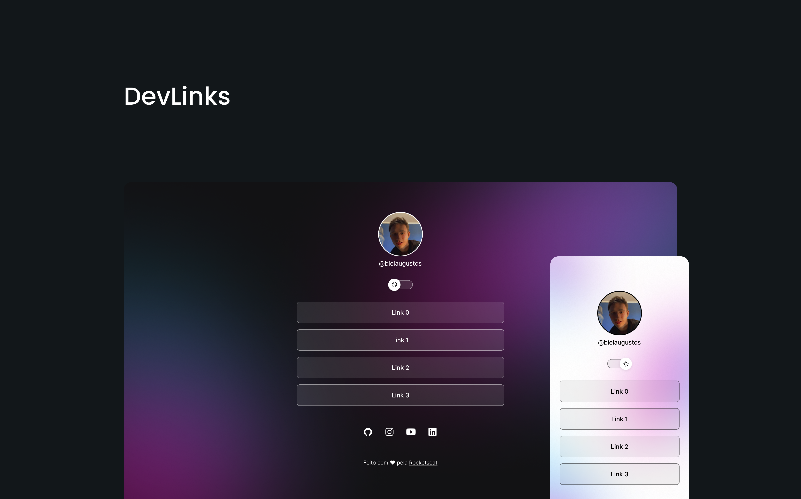

<h1 align="center"> DevLinks </h1>

  <a href="#-tecnologias">Tecnologias</a>&nbsp;&nbsp;&nbsp;|&nbsp;&nbsp;&nbsp;
  <a href="#-projeto">Projeto</a>&nbsp;&nbsp;&nbsp;|&nbsp;&nbsp;&nbsp;
  <a href="#-layout">Layout</a>&nbsp;&nbsp;&nbsp;|&nbsp;&nbsp;&nbsp;
  <a href="#memo-licença">Licença</a>

  

 

  

## 🚀 Tecnologias

Esse projeto foi desenvolvido com as seguintes tecnologias:

- HTML e CSS
- JavaScript
- Git e Github
- Figma

## 💻 Projeto

O DevLinks é um agregador de links para usar como cartão de visitas online.

- [Acesse o projeto finalizado 🚀](https://devlinks-bielaugustos.vercel.app/)

## 🔖 Layout

Você pode visualizar o layout do projeto através [Deste Link](https://www.figma.com/file/RsMd1SV0Ins8uXxewKfYhZ/DevLinks-%E2%80%A2-Projeto-Discover-(Community)?type=design&node-id=1606%3A1128&mode=design&t=bWwXs2zIZiSqJGuf-1). 
 É necessário ter conta no [Figma](https://figma.com) para acessá-lo.

The News CC [Jornal Inteli-gente](https://thenewscc.beehiiv.com/subscribe?ref=xNbdGVtzmD)

## 📄 Licença

Esse projeto está sob a licença MIT.

---

Feito com ♥ by Rocketseat - [Participe da nossa comunidade!](https://discord.gg/rocketseat)